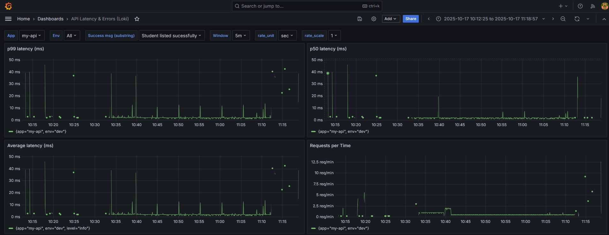
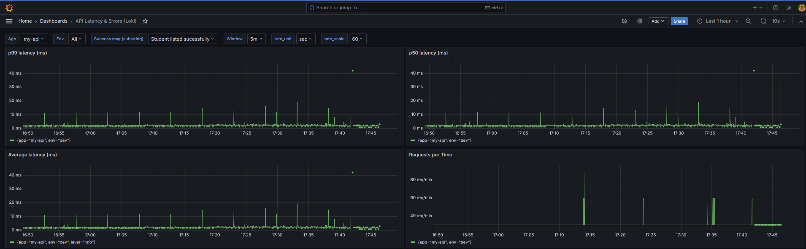
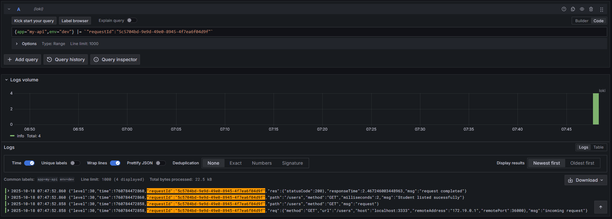
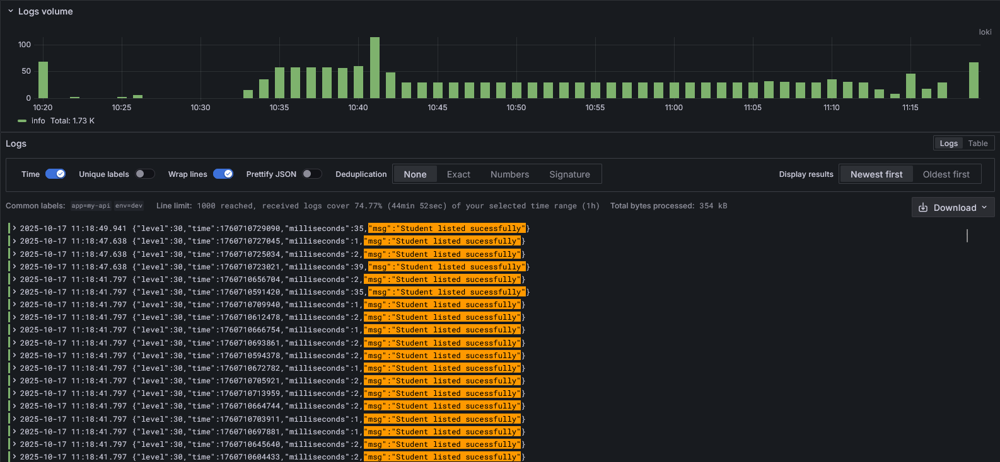

## Gestão de Alunos — API

API responsável por cadastrar e gerenciar alunos de uma instituição EdTech.
Stack principal: Node.js + TypeScript + Fastify + Prisma + PostgreSQL, com observabilidade via Pino → Loki e documentação OpenAPI/Swagger.

Demo da documentação (Swagger UI): http://docs-api.amais.fabiana.petrovick.work/

## Requisitos

- Node.js 22.x
- Docker 24+ e docker compose
- PostgreSQL 16+ (se for rodar sem Docker)

## Como executar o projeto

1) Clone o repositório e execute:
```
make run-all
```

## Testes

- Unitários em tests/.

- Cobertura: npm run coverage (via c8).

## Rotas

- POST /students — cria aluno (campos obrigatórios: nome, e-mail, CPF, RA).
- GET /students — lista alunos com paginação e filtro q (RA/nome/CPF).
- GET /students/{ra} — detalha por RA.
- PUT /students/{ra} — atualiza dados por RA.
- DELETE /students/{ra} — remove por RA.

A especificação OpenAPI está em docs/OpenAPI e é publicada no Swagger UI.


## Arquitetura


O sistema segue uma arquitetura centrada em uma API HTTP Fastify que orquestra as operações de alunos. O diagrama C4 mostra o cliente (portais internos ou integrações) consumindo a API, que persiste dados via Prisma em um PostgreSQL. Logs estruturados fluem para um stack de observabilidade com Loki + Grafana, enquanto a documentação OpenAPI é exposta pelo Swagger UI para facilitar a integração dos consumidores.

## Observabilidade e Rastreabilidade



Painel Loki + Grafana com p99, p50 e média de latência, além do volume de requisições por minuto. Ajuda a identificar regressões de desempenho e picos de tráfego.



Mesmo painel em janela mais estável, evidenciando a linha de base de latência da API e o throughput sustentado.



Pesquisa de logs estruturados no Loki usando `requestId` para rastrear ponta a ponta uma requisição específica, inspecionando tempos, payloads e mensagens correlatas.



Exemplo de logs JSON enviados pelo Pino e agregados pelo Loki, com histograma de volume e mensagens destacando eventos de sucesso para análise exploratória.

> Nota: Os dashboards e logs estruturados descritos acima servem como ponto de partida para monitorar throughput e detectar gargalos quando esses testes forem executados.
