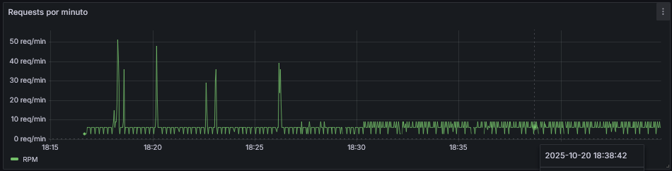

## Gestão de Alunos — API

API responsável por cadastrar e gerenciar alunos de uma instituição EdTech.
Stack principal: Node.js + TypeScript + Fastify + Prisma + PostgreSQL, com observabilidade via Pino → Loki e documentação OpenAPI/Swagger.

### Links Úteis
- Sistema Web (Vue.JS): [https://amais-fabiana.petrovick.work](https://amais-fabiana.petrovick.work)
- API do Sistem Web(Node.JS): [http://amais-api.fabiana.petrovick.work](https://amais-api-fabiana.petrovick.work)
- Documentação (Swagger UI): [http://docs-api.amais.fabiana.petrovick.work](https://docs-api-amais-fabiana.petrovick.work)
- Link do Grafana (Logs): [http://grafana.amais.fabiana.petrovick.work](https://grafana-amais-fabiana.petrovick.work/d/loki-students-full/dashboard-alunos?orgId=1&refresh=10s)
    - Usuário: admin e Senha: 12345678 
    - Link [Dashboard](https://grafana-amais-fabiana.petrovick.work/d/loki-students-full/dashboard-alunos?orgId=1&refresh=10s)

## Requisitos

- Node.js 22.x
- Docker 24+ e docker compose
- PostgreSQL 16+ (se for rodar sem Docker)

## Como executar o projeto

1) Clone o repositório e execute:
```
make run-all
```

## Testes

- Unitários em tests/.

- Cobertura: npm run coverage (via c8).

## Rotas

- POST /students — cria aluno (campos obrigatórios: nome, e-mail, CPF, RA).
- GET /students — lista alunos com paginação e filtro q (RA/nome/CPF).
- GET /students/{ra} — detalha por RA.
- PUT /students/{ra} — atualiza dados por RA.
- DELETE /students/{ra} — remove por RA.

A especificação OpenAPI está em docs/OpenAPI e é publicada no Swagger UI.


## Arquitetura


O sistema segue uma arquitetura centrada em uma API HTTP Fastify que orquestra as operações de alunos. O diagrama C4 mostra o cliente (portais internos ou integrações) consumindo a API, que persiste dados via Prisma em um PostgreSQL. Logs estruturados fluem para um stack de observabilidade com Loki + Grafana, enquanto a documentação OpenAPI é exposta pelo Swagger UI para facilitar a integração dos consumidores.

## Observabilidade e Rastreabilidade



Gráfico de throughput que consolida os logs do Loki para mostrar requisições por minuto (RPM). Os picos e quedas identificam rapidamente quando houve rajadas de chamadas, deixando claro em que momentos a API operou sob maior carga.


Visualização focada em eventos de erro, exibindo quantidade de erros que surgiram a cada minuto. Útil para correlacionar quedas de RPM com causas reais e sinalizar janelas em que o comportamento da API degradou.


Painel resumo com contadores dos últimos cinco minutos, permitindo acompanhar rapidamente o volume total de requisições e quantas falharam no mesmo intervalo. 


Tabela que ranqueia as mensagens de erro mais recorrentes. No exemplo, a falha ao registrar novos alunos aparece várias vezes, indicando exatamente qual feature merece atenção prioritária da equipe.

> Nota: não foram realizados testes de carga até o momento. Esses dashboards e os logs estruturados que os alimentam são a base para acompanhar throughput, taxa de erros e principais mensagens, acelerando a análise quando exercícios de carga forem executados ou acompanhamentos da aplicação.
